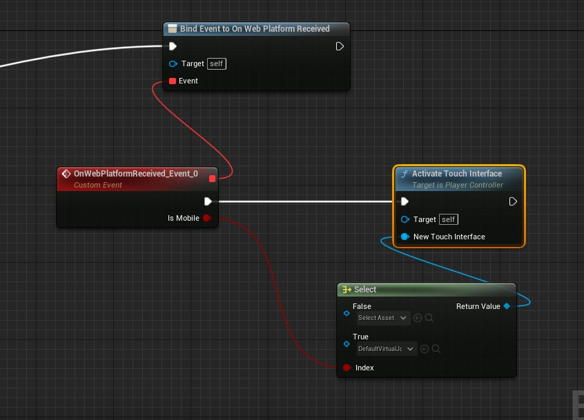

# Mobile UI

- For Default joysticks you need to enable always show touch interface in project settings.
- Disable touch interface in beginplay . (Using node used below)
- Use platform event to load your desired UI .  
