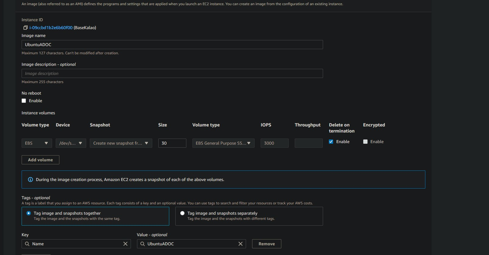

# Updater

## Manager will check for update if all these conditions are met:
- Instance is off 
- There is an Image with same name as instance
- The Image id is not same is instance Image ID

After updating an base instance you can create an image and tag it like this :
